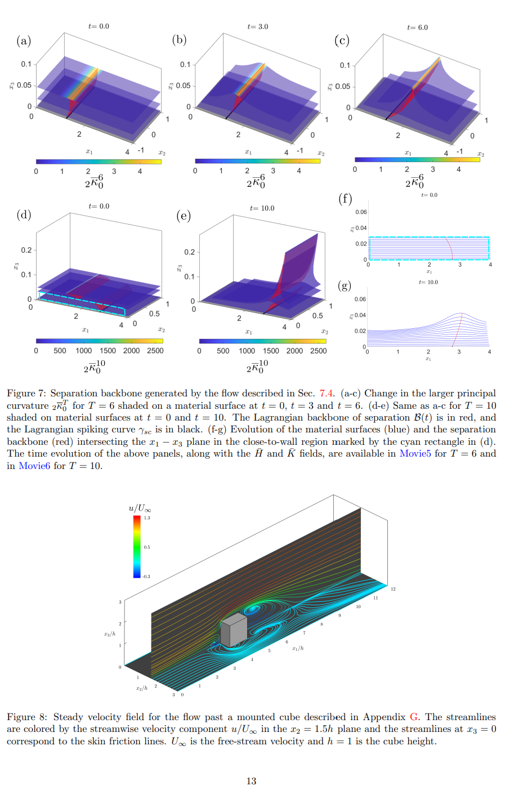

# Spike Formation Theory in Three-Dimensional Flow Separation

This repository accompanies the paper:

> **S. Santhosh, H. Qin, B. F. Klose, G. B. Jacobs, J. Vétel (2023).** *Spike formation theory in three-dimensional flow separation.* **Journal of Fluid Mechanics**, Cambridge University Press, published online 22 Aug 2023. [https://doi.org/10.1017/jfm.2023.559](https://doi.org/10.1017/jfm.2023.559)

It provides MATLAB code to reproduce key geometric computations used in the theory: construction of parallel material surfaces, evaluation of the flow map and its first/second derivatives, Weingarten map, principal curvatures ((\lambda_1 \le \lambda_2)), Gaussian curvature, and the extraction of spike/separation structures from gradients of the largest principal curvature (\lambda_2).

> **Note:** Simulation data and certain helper routines may be available upon request to the authors (per journal policy). This repository focuses on the core geometric workflow and demo scripts.

---

## ✨ What this code does

1. **Define initial material surfaces** (planes or cylinders) parameterized by ((u,v)) and stacked across offsets `h_list`.
2. **Integrate a flow map** on a Cartesian 3D grid ((x_1,x_2,x_3)) over a finite time `tspan`, using parallel ODE solves.
3. **Interpolate the flow map and its Jacobian** onto the initial surfaces to obtain tangent push-forwards (F_u, F_v).
4. **Compute surface geometry:** First fundamental form (E,F,G), unit normal **N**, second fundamental form (L,M,N), **Weingarten map** **W**, eigenpairs (principal curvatures), and **Gaussian curvature**.
5. **Extract separation features** by evolving streamlines of the gradient field (\nabla \lambda_2) on the initial sheets and mapping them forward by the flow.
6. **Visualize** surfaces, principal/gaussian curvature fields, and separation lines.

---

## 🧩 Requirements

* MATLAB R2021a or newer
* Toolboxes

  * **Parallel Computing Toolbox** (recommended; used for `parfor` and multi-core ODE solves)
  * **MATLAB ODE suite** (built-in `ode45`)
* Hardware: multi-core CPU recommended

---

## 📁 Repository Structure

```
.
├── main_demo.m                # End-to-end script (adapted from the provided code)
├── helpers/
│   ├── sigma_surface_plane.m  # Surface mapping σ(u,v;h) for planes
│   ├── sigma_surface_cylinder.m
│   ├── flow_map_curved_ridge.m# Integrates flow on 3D grid (calls your velocity field)
│   ├── velocity_field_lambda.m# RHS for λ2-gradient streamline evolution on sheets
│   └── (other helper functions as needed)
└── figs/                      # Optional: saved figures
```

> If you do not see specific helpers, implement stubs or contact the authors. The demo expects surface mappers (`sigma_*`), a grid flow map integrator, and a 2D gradient-flow RHS for (\nabla \lambda_2).

---

## 🚀 Quick Start

1. **Set core parameters** in `main_demo.m`:

   ```matlab
   grid_separation = 0.01;       % grid spacing in all directions
   u_list = -3:grid_separation:3;
   v_list = -3:grid_separation:3;
   h_list = 0.3:0.2:0.3;         % offsets for parallel sheets (can be a vector)
   tspan  = 0:0.1:0.5;           % flow-map integration times
   MaxNcores = 24;               % cap for parallel workers
   ```

2. **Define surfaces** via `sigma_surface_plane` (default) or swap to cylinder version:

   ```matlab
   [x1_0,x2_0,x3_0] = sigma_surface_plane(u_2d_grid, v_2d_grid, h_list);
   % or:
   % [x1_0,x2_0,x3_0] = sigma_surface_cylinder(u_2d_grid, v_2d_grid, h_list);
   ```

3. **Provide a flow** to `flow_map_curved_ridge.m`.

   * This routine must integrate your 3D velocity field to return the flow map on a Cartesian grid over `tspan`, i.e., `F1_tSeries_grid`, `F2_tSeries_grid`, `F3_tSeries_grid`.

4. **Run the demo**:

   ```matlab
   % optional: start parallel pool
   % parpool('local');
   main_demo
   ```

5. **Outputs**

   * Surfaces at **t=0** and mapped surfaces at **t>0** (surf plots)
   * Scalar fields: **largest principal curvature** (λ2) and **Gaussian curvature**
   * Separation curves extracted from the gradient field **∇λ2** on initial sheets and mapped forward

---

## 🔬 Methods Summary

* **Tangent push-forwards:**
  [ F_u = (\nabla F) ; \sigma_u, \quad F_v = (\nabla F) ; \sigma_v. ]
* **First fundamental form:** (E = F_u\cdot F_u,\ F = F_u\cdot F_v,\ G = F_v\cdot F_v), with area factor (J = \sqrt{EG-F^2}.)
* **Unit normal:** (\mathbf{N} = (F_u \times F_v)/J).
* **Second fundamental form:** (L = \mathbf{N}\cdot F_{uu},\ M = \mathbf{N}\cdot F_{uv},\ N = \mathbf{N}\cdot F_{vv}.)
* **Weingarten map:** (\mathbf{W} = \mathbf{I}^{-1}\mathbf{II}), with entries W11, W12, W21, W22 in the ((u,v)) basis.
* **Principal curvatures:** eigenvalues of **W** ((\lambda_1 \le \lambda_2)); **Gaussian curvature** (K = \lambda_1\lambda_2).
* **Separation/spike curves:** obtained as streamlines of **∇λ2** on the initial sheets, integrated via `ode45` and mapped through the flow.

---

## ⚠️ Numerical Notes

* Use **consistent spacing** (`grid_separation`) for `gradient` and `interp3`.
* Clamp/handle **NaNs** after interpolation; guard `sqrt` and `eig` against negative round-off.
* For **large domains**, tighten ODE tolerances and consider shorter time steps.
* If `matchpairs` or other toolboxes are unavailable, provide simple greedy fallbacks where needed.

---

## 🧬 Example Segmentation Result

The figure below shows an example of flow separation wall output produced by the pipeline:




---

## 📝 Citation

If you use this code, please cite the paper:

> Santhosh, S., **Qin, H.**, Klose, B.F., Jacobs, G.B., & Vétel, J. (2023). *Spike formation theory in three-dimensional flow separation.* Cambridge University Press (JFM), 22 Aug 2023. [https://doi.org/10.1017/jfm.2023.559](https://doi.org/10.1017/jfm.2023.559)

---

## 📬 Contact

For questions or requests (including data/helper functions), please contact the authors via the journal page or open an issue in this repository.
